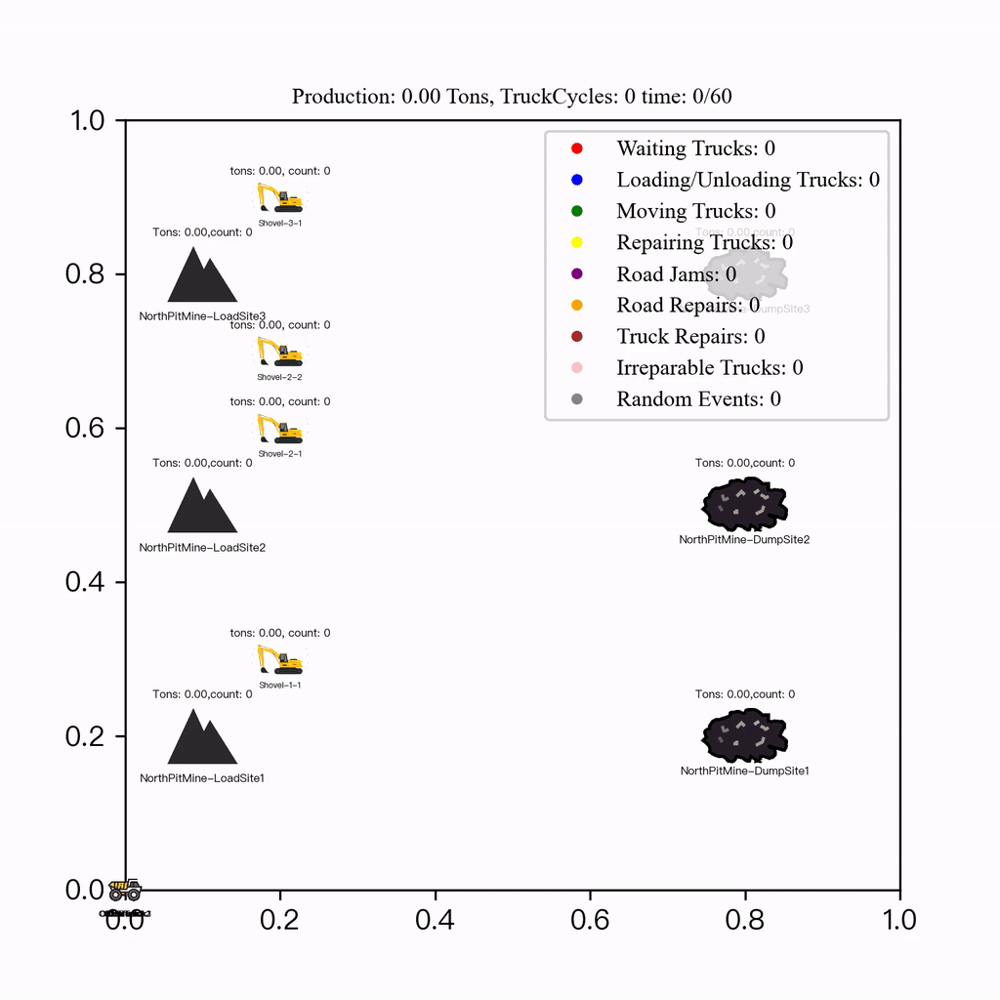
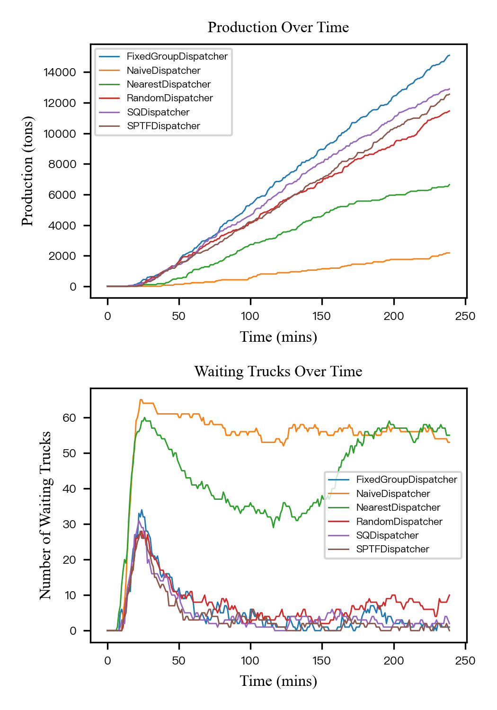
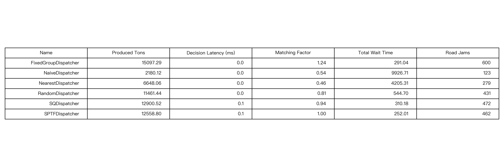
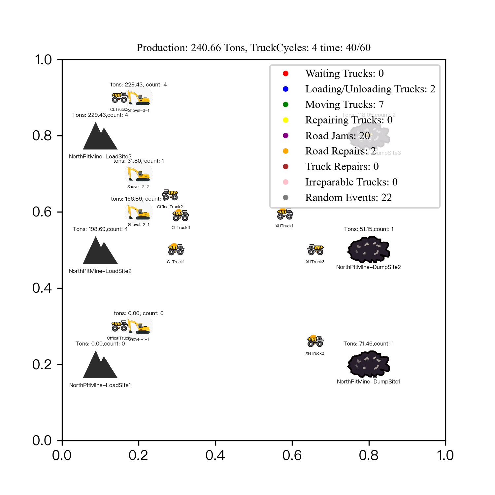

# OpenMines: A Light and Comprehensive Mining Simulation Environment for Truck Dispatching
Accepted in: 2024 35th IEEE Intelligent Vehicles Symposium (IV)

Paper: [to be released]

Authors: Shi Meng<sup>1</sup>, Bin Tian<sup>2,∗</sup>, Xiaotong Zhang<sup>3</sup>, Shuangying Qi<sup>4</sup>, Caiji Zhang<sup>5</sup>, Qiang Zhang<sup>6</sup>


## Description
OpenMines is a Python-based simulation environment designed for truck dispatching in mining operations. It provides a flexible and extensible framework to model and simulate various mining scenarios from a complex-system perspective with probabilistic user-defined events, enabling researchers and practitioners to evaluate and compare different dispatching algorithms.

Visualization is supported:


## Installation
OpenMines is available on PyPI and can be installed using pip:
```shell
pip install openmines
```
 
## Usage
### 1. Create a Mine Configuration
First, you need to configure the mine by creating a JSON file. OpenMines provides example configuration files in the openmines/src/conf/ folder.

Example: north_pit_mine.json (Configuration for the North Pit Mine in Holingol, Inner Mongolia, China, with anonymized data)
```python
{
  "mine": {
    "name": "NorthPitMine"
  },
  "dispatcher": {
    "type": ["NaiveDispatcher", "RandomDispatcher", "NearestDispatcher", "FixedGroupDispatcher", "SPTFDispatcher", "SQDispatcher"]
  },
  "charging_site": {
    "name": "NorthPitMineChargingSite",
    "position": [0, 0],
    "trucks": [
      {"type": "OfficalTruck", "count": 9, "capacity": 77, "speed": 25},
      {"type": "CLTruck", "count": 29, "capacity": 35, "speed": 25},
      {"type": "XHTruck", "count": 33, "capacity": 55, "speed": 25}
    ]
  },
  ...
}
```

### 2. Create a dispatch algorithm
you can configurate the dispatch algorithm in the algo folder (openmines/src/dispatch_algorithms/)
the class should inherit from BaseDispatcher and implement the following methods:
**give_init_order, give_haul_order, give_back_order** and property **name**.

For example, the following code is a naive dispatch algorithm that always give the first load site to the truck.
```python
## openmines/src/dispatch_algorithms/naive_dispatch.py
from __future__ import annotations
from openmines.src.dispatcher import BaseDispatcher

class NaiveDispatcher(BaseDispatcher):
    def __init__(self):
        super().__init__()
        self.name = "NaiveDispatcher"

    def give_init_order(self, truck: "Truck", mine: "Mine") -> int:
        return 0

    def give_haul_order(self, truck: "Truck", mine: "Mine") -> int:
        return 0

    def give_back_order(self, truck: "Truck", mine: "Mine") -> int:
        return 0

```
## 3. Run the simulation

then you can run the simulation with the following command:
```shell
openmines -f <config_file>
# or
openmines run -f <config_file>
```
after the simulation, you can find the simulation ticks in the $CWD/result folder.
the result folder will contain the following files:
- **MINE:{mine_name}_ALGO:{algo_name}_TIME:{sim_time}.json**: the mine information  [the ticks]
- {mine_name}_table.tiff [a performance table of the algorithms that was configured in your config]
- {mine_name}.tiff [a production curve of the algorithms over time]


## 4. Visualize the result
you can visualize the result with the following command:
```shell
openmines -v <result_tike_file>.json
# or 
openmines visualize -f <result_tike_file>.json
```
the result will be a gif file in the $CWD/result folder.
